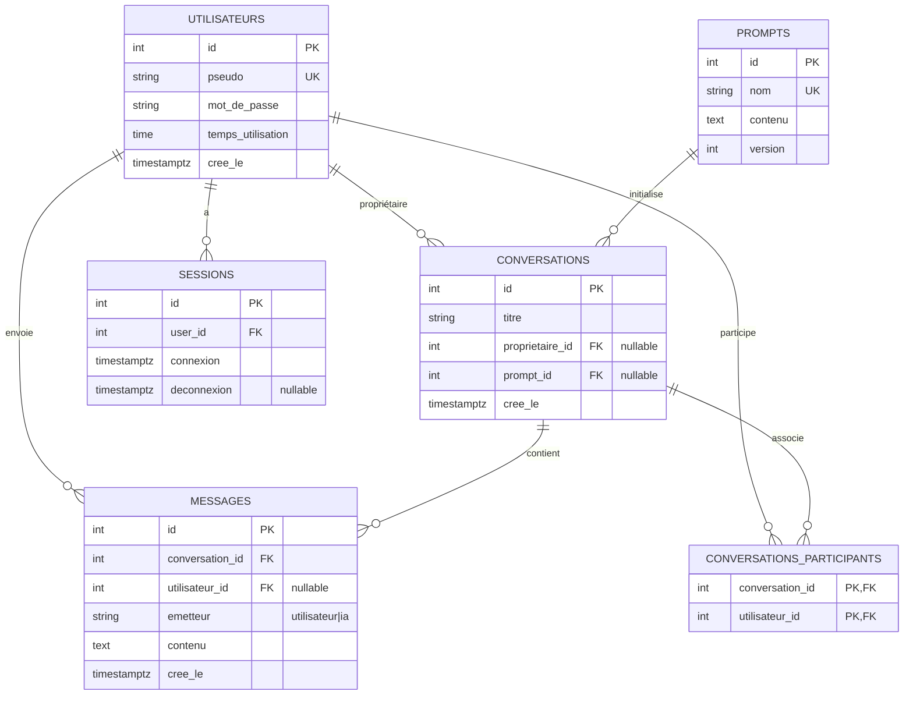

# <EnsaiGPT> 

> Application en ligne de commande pour gérer des conversations avec un LLM (type ChatGPT)
> avec authentification, historique et statistiques d’utilisation.

---

## 📋 Sommaire

- [Présentation](#-présentation)
- [Fonctionnalités](#-fonctionnalités)
- [Architecture](#-architecture)
- [Prérequis](#-prérequis)
- [Installation](#-installation)
- [Configuration](#-configuration)
- [Initialisation de la base de données](#-initialisation-de-la-base-de-données)
- [Lancement de l'application](#-lancement-de-lapplication)
- [Tests et qualité](#-tests-et-qualité)
- [Dépannage](#-dépannage)
- [Licence](#-licence)

---

## 🧾 Présentation

Cette application est un **client en mode texte** (terminal) permettant à des utilisateurs :

- de créer un compte et se connecter,
- de discuter avec un **LLM** via une API REST,
- de sauvegarder leurs conversations,
- de rechercher/ reprendre des conversations,
- de consulter un **tableau de bord de statistiques** (temps d’utilisation, nombre de messages, sujets fréquents, etc.).

Les données (utilisateurs, conversations, messages, sessions, prompts…) sont stockées dans une base **PostgreSQL**.

---

## ✨ Fonctionnalités

- 👤 **Gestion des utilisateurs**
  - Création de compte
  - Connexion / déconnexion
  - Gestion de session avec **JWT**

- 💬 **Conversations avec un LLM**
  - Création d’une nouvelle conversation
  - Envoi de messages et réception de réponses du LLM
  - Historisation des échanges
  - Personnalisation via des *prompts* (modèles de comportement du LLM)

- 📚 **Gestion de l’historique**
  - Liste des conversations de l’utilisateur
  - Reprise d’une conversation existante
  - Recherche de conversations

- 📊 **Statistiques**
  - Nombre de conversations
  - Nombre de messages
  - Temps total d’utilisation
  - Sujets les plus fréquents

- 🧱 **Architecture propre**
  - Découpage en couches :
    - `business_object` (métier),
    - `dao` (accès base de données),
    - `service` (logique applicative),
    - `view` (interface terminal).
  - Accès BDD centralisé via `DBConnection` (pattern Singleton).
  - Client HTTP pour l’API LLM (`LLM_API`).

---

## 🏗 Architecture

Répertoire `src/` :

- `src/main.py` : point d’entrée de l’application
- `src/business_object/` : objets métier (`Conversation`, `Echange`, `Utilisateur`, `Statistiques`, etc.)
- `src/dao/` : accès à la base (`ConversationDAO`, `UtilisateurDao`, `SessionDAO`, etc.)
- `src/service/` : logique métier (`Auth_Service`, `ConversationService`, `Statistiques_Service`, …)
- `src/view/` : interface terminal avec [InquirerPy](https://inquirerpy.readthedocs.io/en/latest/)
  - `accueil/` : accueil, inscription, connexion
  - `menu_utilisateur_vue.py` : menu principal après connexion
  - `conversations_vue.py`, `nouvelle_conversation_vue.py`, `reprendre_conversation_vue.py`, `recherche_conversation_vue.py`
  - `stats_vue.py` : tableau de bord
- `src/client/llm_client.py` : client HTTP pour l’API LLM (appel au webservice)
- `src/utils/` : utilitaires (`reset_database`, gestion des logs, JWT, Singleton…)
- `src/tests/` : tests unitaires par couche (business, dao, service, client)

La structure de base de données (tables `utilisateurs`, `prompts`, `conversations`, `messages`, `sessions`, etc.) est décrite dans `data/init_db.sql` et `doc/diagramme_bdd.md`.

---

## 🔧 Prérequis

- **Python** ≥ 3.10 (3.11 recommandé)
- **PostgreSQL** (local ou instance distante, par ex. SSP Cloud)
- Accès réseau à l’API LLM (par défaut : service ENSAI `ensai-gpt`)


## 📦 Installation

Cloner le dépôt :

```bash
git clone <https://github.com/ENSAI-Projet-Info-2A/ENSAI-2A-projet-info.git>
cd ENSAI-2A-projet-info-main
```

### 💻 Environnement virtuel

Créer un environnement virtuel :

```bash
python -m venv .venv
```

Activer l’environnement :

**Windows PowerShell**
```bash
.venv\Scripts\Activate.ps1
```

**Linux / macOS**
```bash
source .venv/bin/activate
```

### :arrow_forward: Installation des dépendances 

- [ ] Dans Git Bash, exécute les commandes suivantes pour :
  - installer tous les packages à partir du fichier `requirements.txt` ;
  - lister tous les packages installés.

```bash
pip install -r requirements.txt
pip list
```

### :arrow_forward: Variables d’environnement

L'application utilise des variables d’environnement pour se connecter :

- à la base de données PostgreSQL ;
- au système d’authentification (JWT) ;
- éventuellement au webservice LLM.

À la racine du projet :

- [ ] Créer un fichier nommé `.env`
- [ ] Y coller les éléments ci-dessous et les compléter selon votre configuration

````dotenv
# --- Configuration PostgreSQL ---
POSTGRES_HOST=
POSTGRES_PORT=5432
POSTGRES_DATABASE=
POSTGRES_USER=
POSTGRES_PASSWORD=

# --- Configuration JWT ---
# IMPORTANT : Choisir une chaîne longue, aléatoire et privée.
SECRET_KEY=
````

- Voir aussi le .env.exemple

### Initialisation de la base de données (Optionnel, car faisable dans l'application)

Avant de démarrer l'application, initialiser la base :

```bash
python -m src.utils.reset_database
```

Cela va :

- créer le schéma défini dans .env ;
- exécuter data/init_db.sql ;
- préremplir la base (pop_db.sql).


### ▶️ Lancement de l'application

À la racine :

```bash
python -m src.main
```

L'application charge alors :

- les variables d'environnement ;
- la configuration des logs ;
- la connexion PostgreSQL ;
- le menu d’accueil dans le terminal.


## 🧪 Tests et qualité

### Lancer tous les tests :

```bash
pytest
```


### Mesurer la couverture :

```bash
coverage run -m pytest
coverage html
```


## 🛠 Dépannage

### Problème de connexion PostgreSQL

- Vérifier les informations du .env
- Vérifier que la base est active sur SSP Cloud
- Regénérer la base via :
```bash
python -m src.utils.reset_database
```

### Le LLM ne répond pas :

- Vérifier l’accès réseau
- Confirmer l’URL du service dans .env
-  Vérifier les logs dans logs/


## Schéma complémentaire de l'application : 

### Schéma de la BDD :

