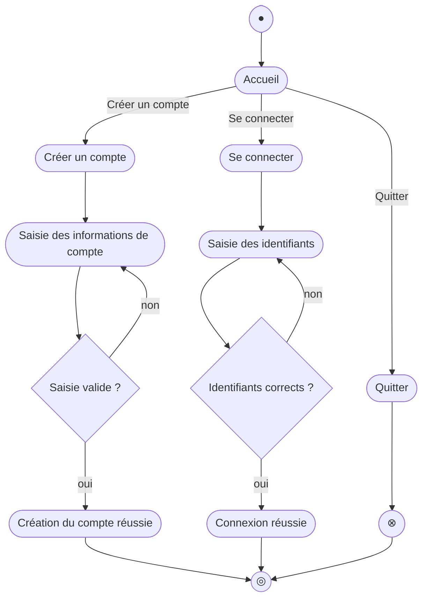

```mermaid
flowchart TD
    %% Début
    start([●]) --> Accueil([Accueil])

    %% Choix principal
    Accueil --> |Créer un compte| Creer([Créer un compte])
    Accueil --> |Se connecter| Connecter([Se connecter])
    Accueil --> |Quitter| Quitter([Quitter])

    %% Branche Création de compte
    Creer --> SaisieInfo([Saisie des informations de compte])
    SaisieInfo --> Valide{Saisie valide ?}
    Valide --> |oui| CreaOk([Création du compte réussie])
    Valide --> |non| SaisieInfo

    %% Branche Connexion
    Connecter --> SaisieId([Saisie des identifiants])
    SaisieId --> Correct{Identifiants corrects ?}
    Correct --> |oui| ConnOk([Connexion réussie])
    Correct --> |non| SaisieId

    %% Branche Quitter
    Quitter --> finX([⊗])

    %% Fin commune
    CreaOk --> fin((◎))
    ConnOk --> fin
    finX --> fin
```