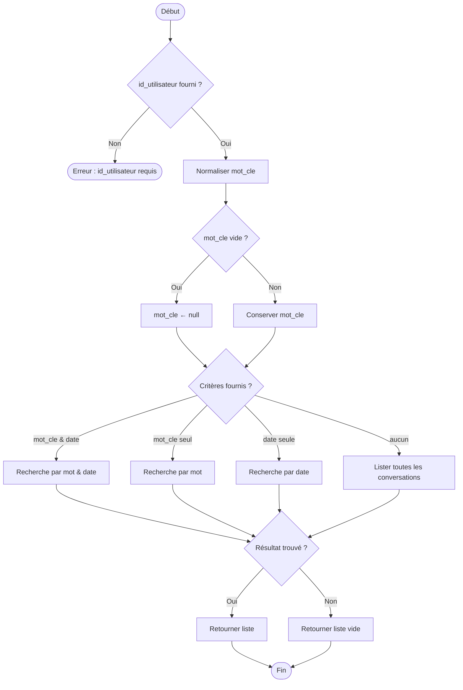

```mermaid
flowchart TD
  A([Début]) --> B{id_utilisateur fourni ?}
  B -->|Non| Z([Erreur : id_utilisateur requis])
  B -->|Oui| C[Normaliser mot_cle]

  C --> D{mot_cle vide ?}
  D -->|Oui| E[mot_cle ← null]
  D -->|Non| F[Conserver mot_cle]

  E --> G
  F --> G

  G{Critères fournis ?} -->|mot_cle & date| H[Recherche par mot & date]
  G -->|mot_cle seul| I[Recherche par mot]
  G -->|date seule| J[Recherche par date]
  G -->|aucun| K[Lister toutes les conversations]

  H --> L
  I --> L
  J --> L
  K --> L

  L{Résultat trouvé ?} -->|Oui| M[Retourner liste]
  L -->|Non| N[Retourner liste vide]

  M --> O([Fin])
  N --> O
```