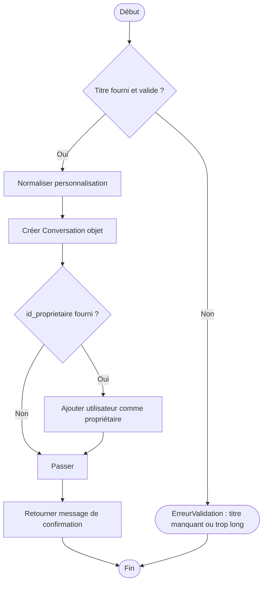

```mermaid
flowchart TD
    Start([Début]) 

    %% Validation du titre
    Start --> VérifTitre{Titre fourni et valide ?}
    VérifTitre -- Non --> ErreurTitre([ErreurValidation : titre manquant ou trop long])
    VérifTitre -- Oui --> NormaliserPrompt[Normaliser personnalisation ]

    %% Création de la conversation
    NormaliserPrompt --> CreerConv[Créer Conversation objet]

    %% Ajout propriétaire
    CreerConv --> Proprietaire{id_proprietaire fourni ?}
    Proprietaire -- Oui --> AjouterProp[Ajouter utilisateur comme propriétaire]
    Proprietaire -- Non --> Continuer[Passer]
    AjouterProp --> Continuer

    %% Retour du résultat
    Continuer --> RetourMsg[Retourner message de confirmation]

    %% Fin
    RetourMsg --> End([Fin])
    ErreurTitre --> End

```